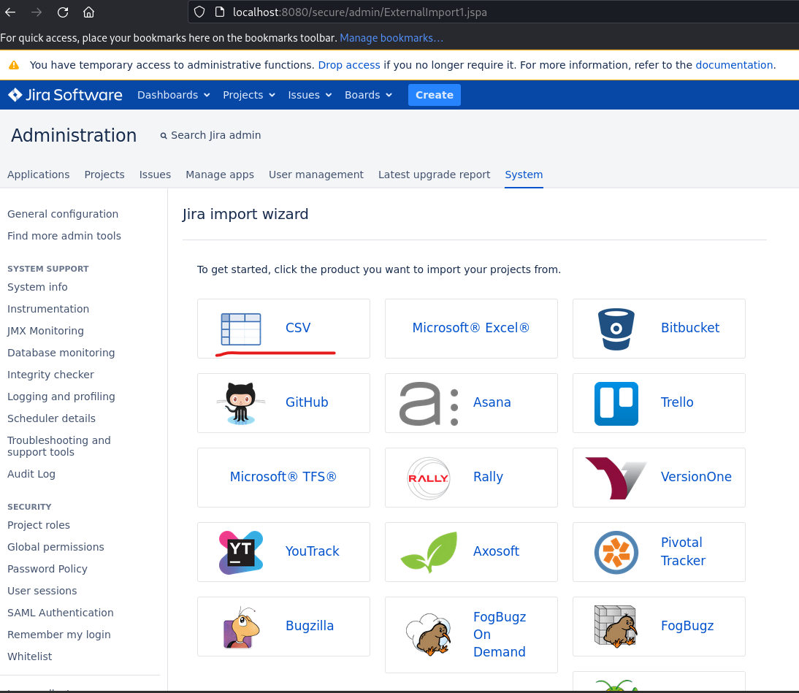
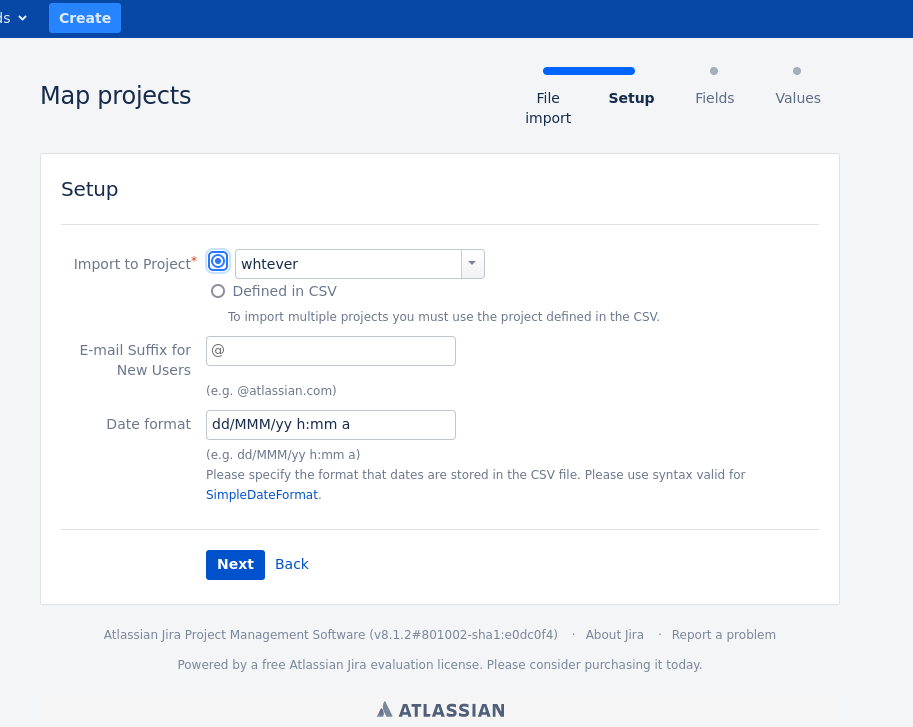
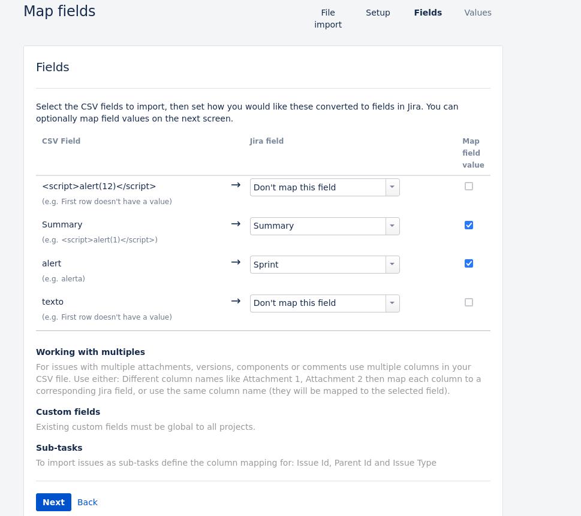
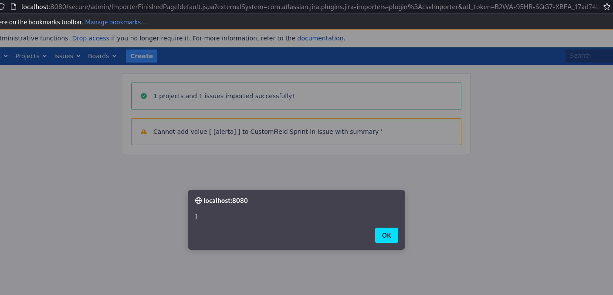

# Exploit Title: Atlassian Jira – (Authenticated) Reflected XSS ImporterFinishedPage.jspa via error message

## Exploit Author
elpe_pinillo

## Version
version < 8.13.12 , 8.14.0 ≤ version < 8.20.2

## CVE
CVE-2021-41304

## Summary
Execution of XSS in error message of /secure/admin/ImportFinishedPage.jspa endpoint in Jira servers with authenticated User. The vulnerability consists on taking advantage of a little small window of opportunity.

The administrator is the only user capable of Importing External System Configuration. This functionality can be used to upload a CSV file with data to be imported, but the server does not validate the data to be imported. Therefore, if the CSV file has some data with improper format, the server prints some error messages in the /ImportFinishedPage.jspa endpoint.

But this is not the only issue; the administrator is expected to be the only one uploading CSV file, but the server does not control the role of the user uploading the file.

## POC – Admin XSS execution:
1. Login to Jira Server with admin user.
2. Go to http://server_address/secure/admin/ExternalImport1.jspa

3. Select CSV and upload the payload.csv file.
4. Import to Any Project and next:

5. At this point, the fields you had included in the CSV should appear. You should map “Summary” CSV field with “Summary” Jira field and “alert” CSV field with Sprint Jira field.

6. Click Next and Begin.
7. The process launches an error and the XSS is executed.

